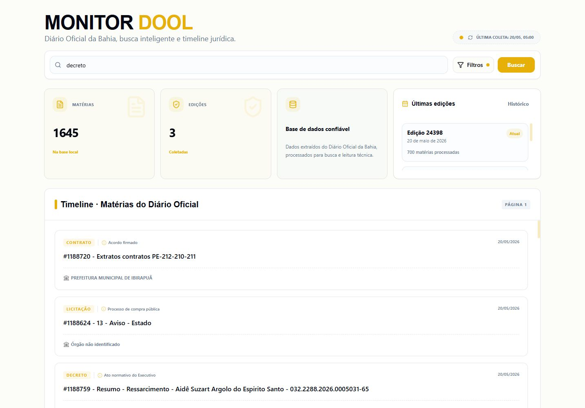
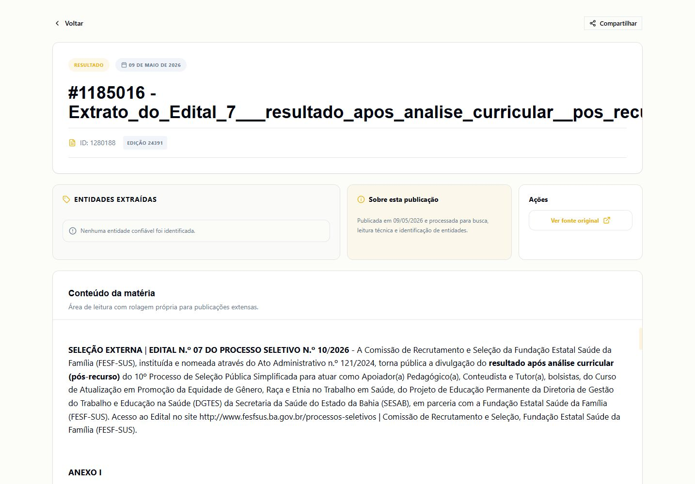
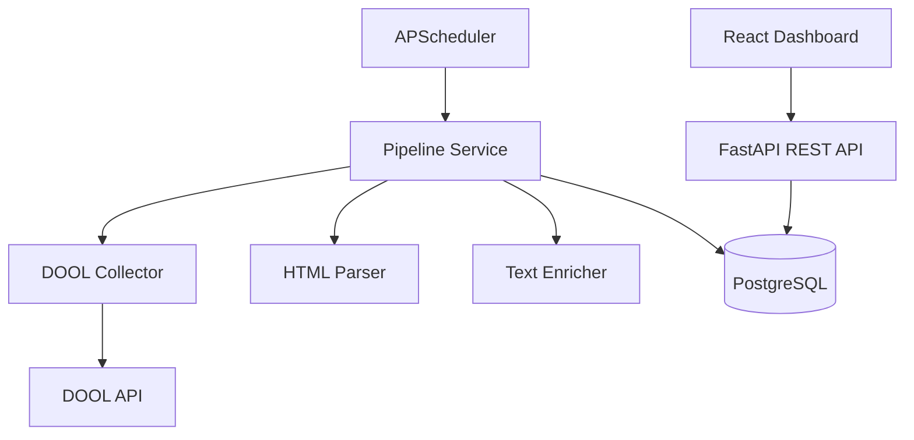

# Monitor DOOL

Dashboard informativo para monitoramento das publicacoes do Diario Oficial da Bahia.

O projeto combina um backend FastAPI com pipeline de coleta, parser HTML, enriquecimento de dados e uma interface React/Vite focada em busca, filtros, timeline e leitura tecnica das materias publicadas.

## Screenshots

### Dashboard



### Detalhe da materia



## Principais funcionalidades

- Timeline de materias com paginacao.
- Busca textual com debounce e query string.
- Filtros por tipo documental e data da edicao.
- Historico de edicoes coletadas.
- Pagina de detalhe com HTML sanitizado.
- Renderizacao responsiva de tabelas das materias.
- Download de PDF quando a fonte original disponibiliza arquivo.
- Cards de resumo da base local.
- Feedbacks com toast e estados de loading, empty e error.
- Scheduler backend para coleta automatica.
- Endpoints administrativos protegidos por API key.

## Stack

### Frontend

- React
- Vite
- TypeScript
- React Router
- Axios
- Tailwind CSS
- Radix UI/shadcn-style components
- Sonner
- Vitest + Testing Library

### Backend

- FastAPI
- SQLAlchemy Async
- Alembic
- PostgreSQL
- httpx
- selectolax
- APScheduler
- pytest

## Arquitetura



## Como rodar com Docker

1. Copie o arquivo de exemplo:

```bash
cp .env.example .env
```

2. Ajuste as variaveis no `.env`.

3. Suba os containers:

```bash
docker-compose up -d --build
```

4. Acesse:

- Frontend: `http://localhost:5173`
- API: `http://localhost:8000`
- Swagger: `http://localhost:8000/docs`

## Como rodar localmente

### Backend

```bash
cd backend
python -m venv venv
venv\Scripts\activate
pip install -r requirements.txt
alembic upgrade head
uvicorn app.main:app --reload
```

### Frontend

```bash
cd frontend
npm install
npm run dev
```

## Variaveis de ambiente

Principais variaveis do `.env`:

```env
APP_ENV=development
DEBUG=True
ADMIN_API_KEY=

POSTGRES_USER=monitor_dool_user
POSTGRES_PASSWORD=your_secure_password_here
POSTGRES_DB=monitor_dool_db
POSTGRES_HOST=db
POSTGRES_PORT=5432

DOOL_BASE_URL=https://dool.egba.ba.gov.br
DOOL_TIMEOUT=120
DOOL_MAX_CONCURRENCY=20

SCHEDULER_ENABLED=True
SCHEDULER_TIMEZONE=America/Sao_Paulo
SCHEDULER_COLLECTION_HOUR=8
SCHEDULER_COLLECTION_MINUTE=0
SCHEDULER_BACKUP_HOUR=12
SCHEDULER_BACKUP_MINUTE=0
SCHEDULER_STATS_INTERVAL_HOURS=6
```

No frontend, a URL da API e definida por:

```env
VITE_API_URL=http://localhost:8000/api/v1
```

## Endpoints principais

| Metodo | Endpoint | Descricao |
| --- | --- | --- |
| `GET` | `/api/v1/edicoes/` | Lista edicoes coletadas |
| `GET` | `/api/v1/edicoes/data/{data}` | Busca edicao por data |
| `GET` | `/api/v1/materias/` | Lista materias paginadas |
| `GET` | `/api/v1/materias/search/` | Busca com filtros |
| `GET` | `/api/v1/materias/{id}` | Detalhe completo da materia |
| `GET` | `/api/v1/materias/{id}/pdf` | Download do PDF quando disponivel |
| `GET` | `/api/v1/materias/filtros` | Opcoes enxutas de filtros |
| `GET` | `/api/v1/materias/estatisticas/resumo` | Resumo da dashboard |
| `POST` | `/api/v1/tasks/coleta/{data}` | Dispara coleta manual |
| `POST` | `/api/v1/tasks/jobs/{id}/run` | Executa job agendado manualmente |

## Endpoints administrativos

Endpoints que disparam coletas ou jobs manuais exigem o header `X-Admin-API-Key` quando `ADMIN_API_KEY` estiver configurada.

Em `APP_ENV=production`, a API recusa esses endpoints se `ADMIN_API_KEY` estiver vazia.

Exemplo:

```bash
curl -X POST \
  -H "X-Admin-API-Key: sua-chave-forte" \
  "http://localhost:8000/api/v1/tasks/coleta/2026-05-20"
```

O scheduler interno continua executando as coletas programadas sem depender desse header.

## Decisoes tecnicas

### Coleta e scheduler

A coleta automatica fica no backend via APScheduler. O frontend nao dispara coleta automaticamente ao abrir a dashboard, evitando spam de requisicoes e toasts quando a edicao do dia ainda nao foi publicada.

### Estado por URL

Busca, filtros e pagina da timeline sao refletidos na URL. Isso permite refresh, compartilhamento de estado e retorno da pagina de detalhe sem perder contexto.

### HTML rico e sanitizacao

As materias podem vir com HTML rico. O frontend sanitiza o conteudo antes de renderizar, preservando tabelas e links seguros. Tabelas recebem wrapper com scroll horizontal para manter responsividade.

### PDF condicional

O botao de download aparece somente quando o backend identifica PDF disponivel. O endpoint valida content-type, assinatura `%PDF-` ou marcadores internos antes de retornar o arquivo.

### Performance

As paginas principais sao carregadas com lazy loading por rota, reduzindo o bundle inicial.

## Validacao

### Backend

```bash
backend\venv\Scripts\pytest.exe backend\tests -p no:cacheprovider
python -m compileall backend\app
```

### Frontend

```bash
cd frontend
npm run test
npm run lint
npm run build
```

## Fluxo de demo sugerido

1. Abrir a dashboard.
2. Buscar por `decreto`.
3. Navegar pela paginacao.
4. Abrir uma materia.
5. Voltar e confirmar que busca/pagina foram preservadas.
6. Abrir o historico de edicoes.
7. Filtrar a timeline por uma edicao especifica.
8. Abrir uma materia com tabela.
9. Demonstrar download de PDF quando disponivel.
10. Mostrar Swagger e endpoints administrativos protegidos.

## Status

O projeto esta pronto para demonstracao tecnica em portfolio, com frontend responsivo, backend com scheduler, seguranca basica para jobs administrativos e testes automatizados cobrindo os fluxos mais sensiveis.
