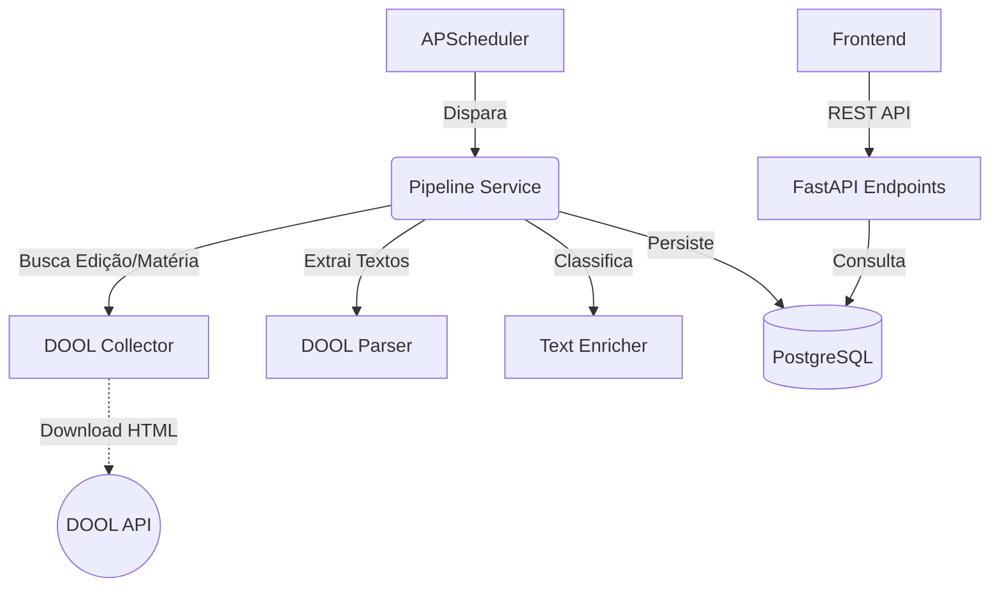

# Monitor DOOL (Diário Oficial Online)

Pipeline de dados para monitoramento e análise das publicações do Diário Oficial.

## 🏗️ Arquitetura

O projeto segue uma arquitetura modularizada:



- **Collectors**: Responsável pela comunicação com a API do DOOL e download de HTMLs.
- **Parsers**: Extração de dados estruturados a partir do HTML usando `selectolax`.
- **Enrichers**: Classificação de documentos e extração de entidades (CPF, CNPJ, etc).
- **Services**: Orquestração da pipeline e lógica de negócio.
- **Database**: Persistência em PostgreSQL usando SQLAlchemy (Async).

## 🚀 Como Rodar

### Com Docker (Recomendado)

1. Configure o arquivo `.env` (use o `.env.example` como base).
2. Suba os containers:
   ```bash
   docker-compose up -d --build
   ```

### Localmente (Desenvolvimento)

1. Crie um ambiente virtual e instale as dependências:
   ```bash
   cd backend
   python -m venv venv
   source venv/bin/activate  # No Windows: venv\Scripts\activate
   pip install -r requirements.txt
   ```
2. Inicie a API:
   ```bash
   uvicorn app.main:app --reload
   ```
3. Ou rode a pipeline via CLI:
   ```bash
   python -m app.main 2026-05-12
   ```

## 🔌 API Endpoints (Principais)

| Método | Endpoint | Descrição |
|--------|----------|-----------|
| `GET`  | `/api/v1/edicoes/` | Timeline de edições processadas |
| `GET`  | `/api/v1/edicoes/data/{data}` | Detalhes da edição por data |
| `GET`  | `/api/v1/materias/search/` | Busca avançada por termo, órgão e data |
| `GET`  | `/api/v1/materias/estatisticas/tipos`| Distribuição de tipos documentais |
| `POST` | `/api/v1/tasks/jobs/{id}/run` | Aciona pipeline ou stats manualmente |

## 🛠️ Tecnologias

- **FastAPI**
- **SQLAlchemy 2.0 (Async)**
- **Alembic** (Migrações)
- **Selectolax** (HTML Parsing ultra-rápido)
- **Httpx** (Client HTTP Async)
- **PostgreSQL**
